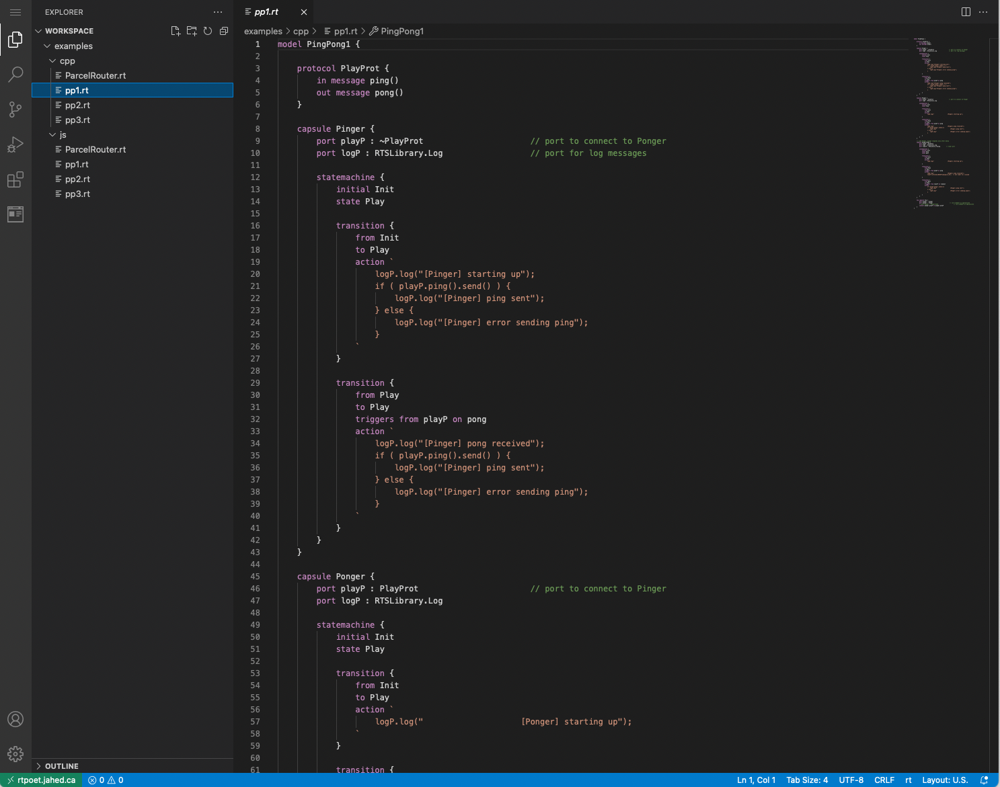
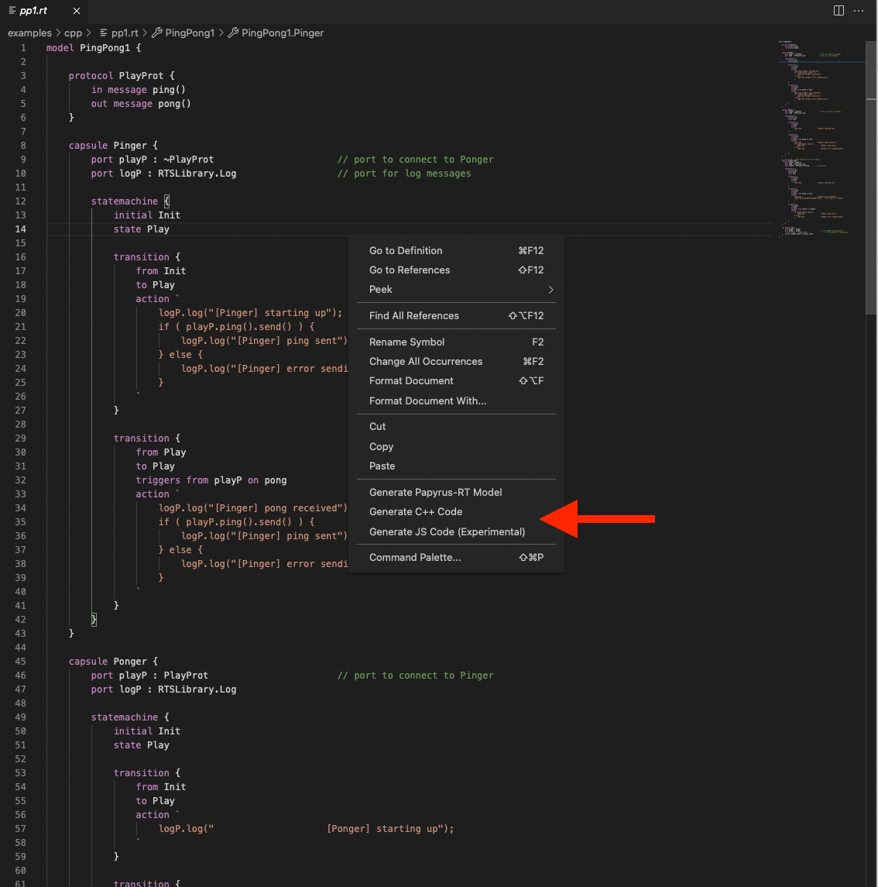
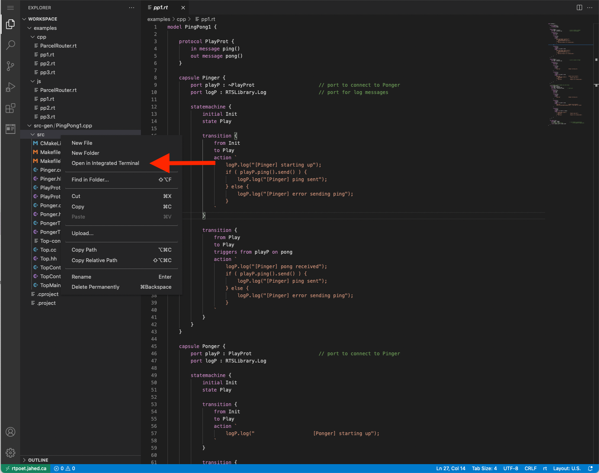
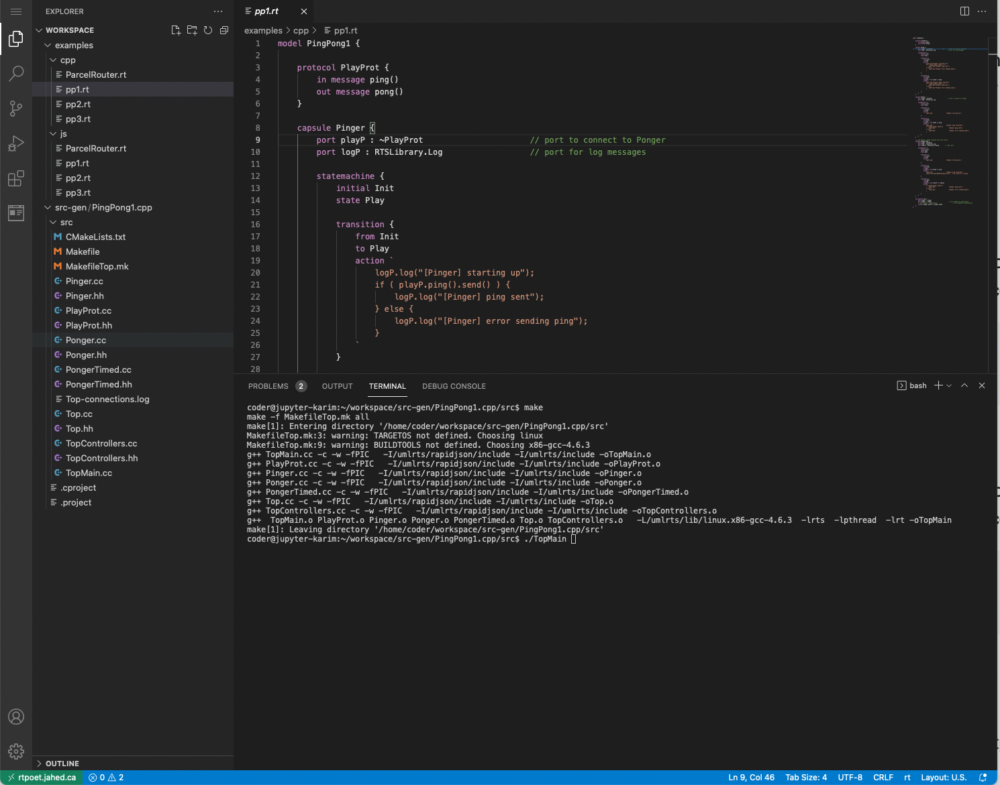
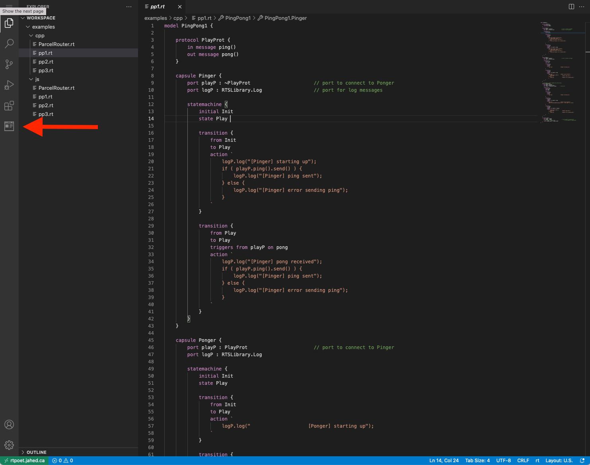

### Model-based Software Development for Sequential, Concurrent, Distributed, and Containerized Reactive Systems
---

This repository contains all the resources for the MBSD for Reactive Systems
tutorial at FDL'21.

### Resources 
- [Tutorial slides]()
- [Sample models](https://github.com/kjahed/FDL21/blob/master/sampleModelsForFDL21Tutorial.zip?raw=true)
- [RSARTE user's guide](https://rsarte.hcldoc.com/help/nav/26)
- [RSARTE installation instructions](http://jahed.ca/rsarte)
- [Textual grammar](https://github.com/kjahed/rtpoet-dsl/blob/master/ca.jahed.rtpoet.dsl/src/main/java/ca/jahed/rtpoet/dsl/Rt.xtext)  
- More resources can be found on Juergen's [graduate course website](https://research.cs.queensu.ca/home/dingel/cisc836_W21/index.html)

### Give UML-RT a try!
The web interface will be available for the public until Sunday, September 12. Head over to [https://rtpoet.jahed.ca](https://rtpoet.jahed.ca) to get started!
You can use any username/password combination to login. Note that the interface works best with Mozilla Firefox.

#### Browsing the examples
The interface is preloaded with examples to help you explore UML-RT's features. All the examples (.rt files) can be found under the ```examples``` subdirectory. There are examples for both Javascript and C++. Simply click on one of the files to open it in the source editor.



#### Generating the code
A right-click whithin the editor tab will open the contex menu that allows you to generate the code. Depending on the model's action code language, you can choose to generate either Javascript or C++ code. The generated code will be available under the ```src-gen``` subdirectory.



#### Executing the C++ code
Right-click on the root directory containing the generated C++ code and choose 'Open in Integrated Terminal'. This will open a terminal tab at the bottom of the screen. To execute the code, execute the following commands:
```bash
cd .
make
./<executable_name>
```





#### Executing the Javascript code
Right-click on the root directory containing the generated JS code and choose 'Open in Integrated Terminal'. This will open a terminal tab at the bottom of the screen. To execute the code, execute the following commands:
```bash
npm i
npm start
```

The Javascript code allows you to observe the execution by animating the state machines. There are two ways to view the animation:

\- (Recommended) find the link to the inspector in the output and open it in another browser tab. The link looks like:
```bash
Inspector: http://rtpoet.jahed.ca/user/kjahed/proxy/3000/inspector.html?server=rtpoet.jahed.ca/user/kjahed/proxy/8801
```

\- Click on the icon shown below to open the animation whithin the web interface itself:


